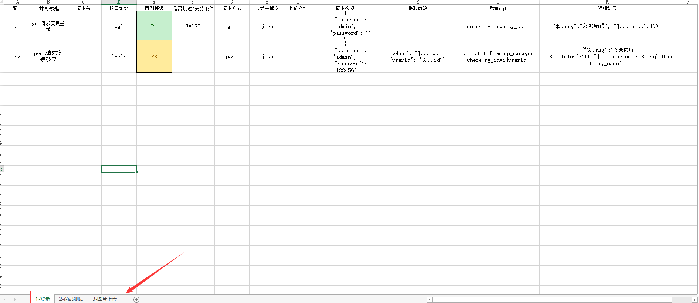
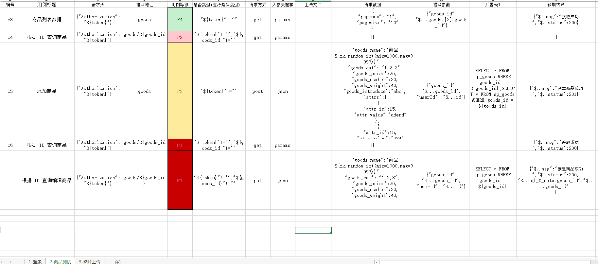
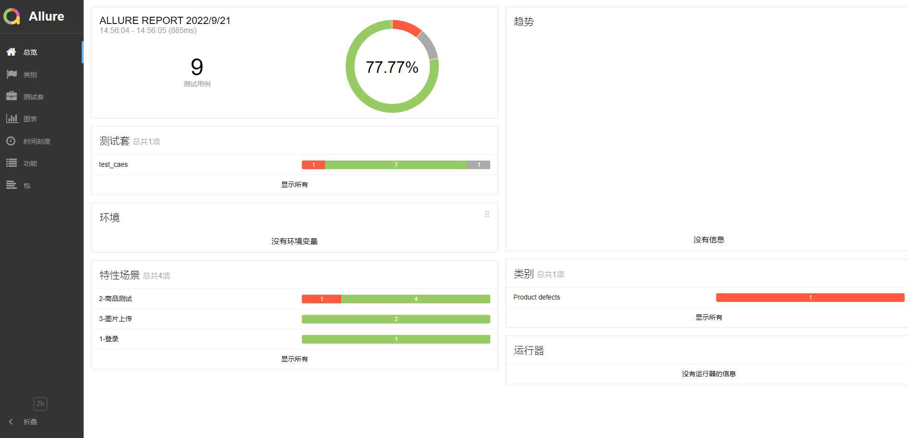
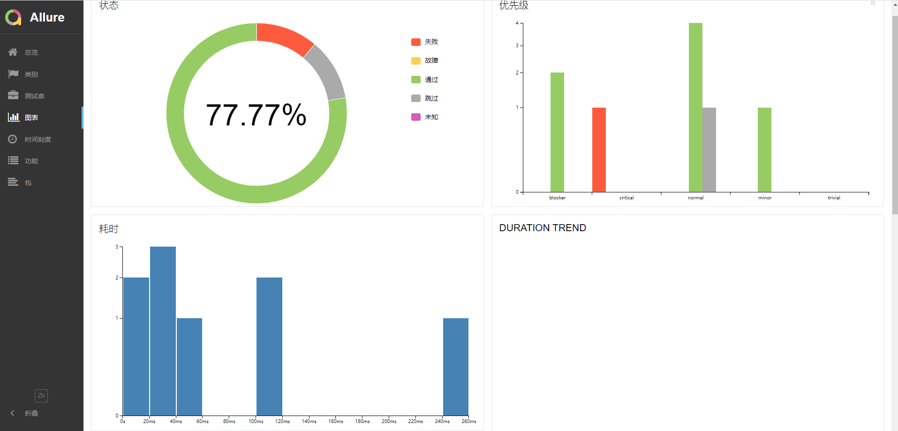
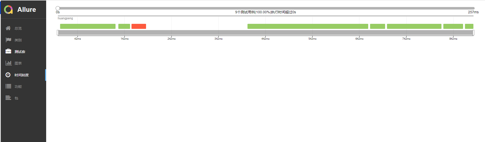
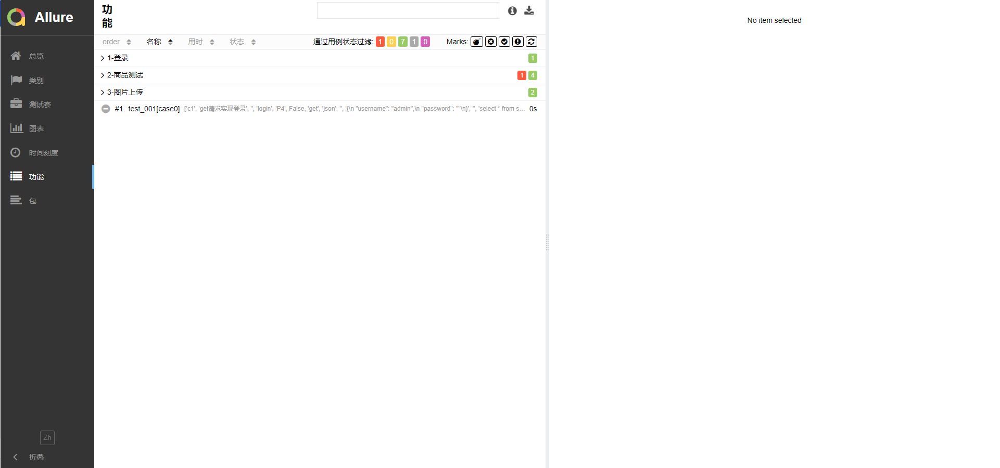
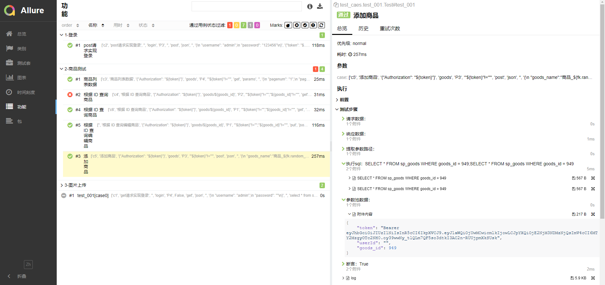
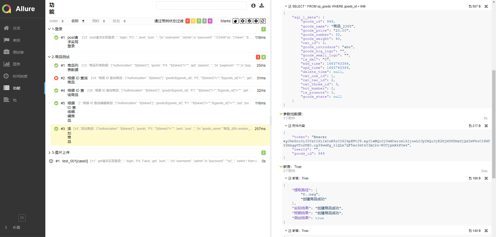
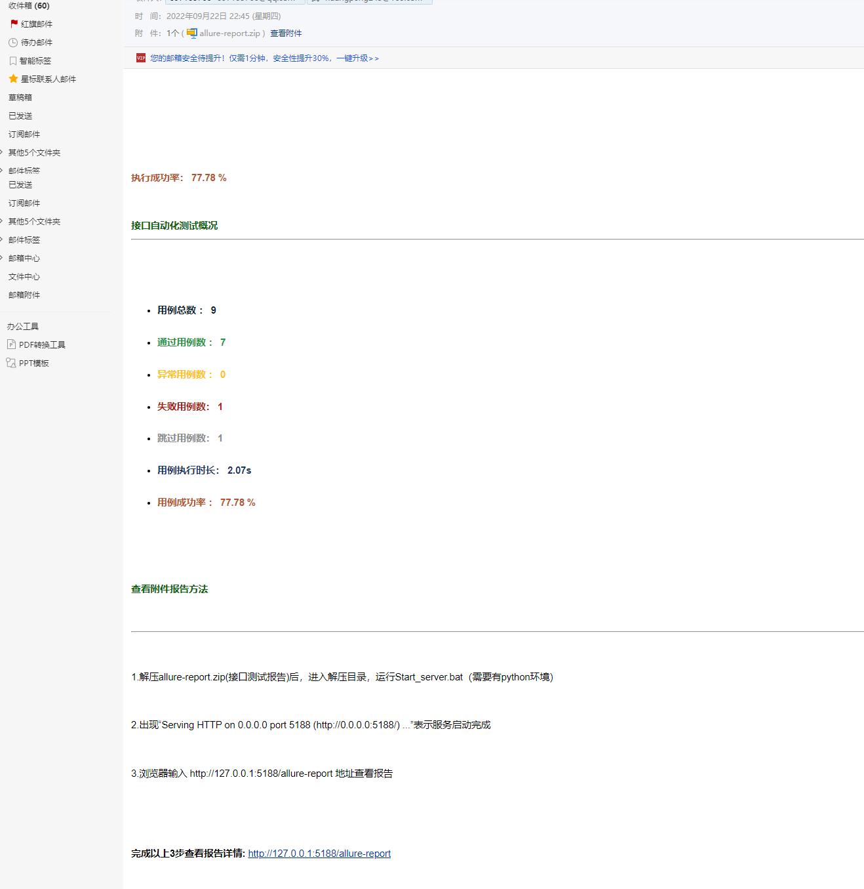

# Aip接口自动化测试pytest+allure+request+jsonpath+excle

#### 介绍
Aip接口自动化测试python+pytest+allure+request+jsonpath+excle，一个支持仅编辑Excle就可实现的接口自动化测试框架。   
1.编辑Excle做接口数据驱动的数据源    
2.接口上下游数据依赖处理   
3.Excel执行函数获取随机值做新增接口数据   
4.数据库查询断言   
5.数据库初始化备份恢复  
6.使用pytest+allure框架   
7.测试完成后打包allure报告为zip包通过邮件发送




#### 软件架构
软件架构说明   
```shell
项目结构：   
├─common    #公共模块类      
│  │  all_path.py  #定义文件路径      
│  │  api_request.py   #发送请求      
│  │  assert_api.py    #请求断言      
│  │  Bak_Rec_DB.py    #备份恢复操作逻辑      
│  │  condition.py     #跳过用例逻辑      
│  │  condition_b.py   #跳过用例逻辑      
│  │  db.py             #数据库读取操作      
│  │  exchange_data.py  #接口参数的数据替换和提取      
│  │  logger.py         #系统日志打印      
│  │  loggers.py        #系统日志打印      
│  │  logger_bak.py     #系统日志打印      
│  │  operation_excle.py #读取写入excel      
│  │  read_file.py      #读取配置文件yaml      
│  │  RemoteServe.py     #远程链接SSH ftp      
│  │  send_email.py     #发送邮件      
│  │__init__.py      
│
├─config  #配置文件和相关资源      
│      1.jpg      
│      3.jpg      
│      config.yaml            
│      mydb.sql      
│      mydb_bak.sql      
│      Start_server.bat      
│      
├─data   #测试数据用例表格      
│      case_data.xlsx      
│      
├─logs  #日志打印文件      
│      20220921.log      
│      __init__.py      
│      
├─report_zip  #测试完成后测试报告压缩包发送邮件      
│      allure-report.zip      
│      __init__.py      
│      
├─target   #运行测试保持的测试报告路径      
├─test_caes   #测试用例文件夹      
│  │  test_001.py  #执行测试用例      
│  └─__init__.py      
│      
│─解析    #解析框架重要的模块      
│        Faker库造测试数据.py      
│        flask开发2个http接口.py      
│        te_001.py      
│        te_09.py      
│        参数依赖01-jsonpath提取参数.py      
│        参数依赖02-locals()获取本地变量 及exec()执行字符串中的代码.py      
│        参数依赖03-Template 使用,替换参数.py      
│        参数依赖04-框架中替换参数及执行字符串中方法取值.py      
│        发送请求01-get方法中url参数拼接和写到请求体中的理解.py      
│        发送请求02-请求参类型params，json，data 含义.py      
│        发送请求03-理解两种发送请求方法.py      
│        发送请求04-封装请求参数转化的理解.py      
│        备份恢复sql-FTP上传文件.py      
│        备份恢复sql-ssh执行命令.py      
│        继承方法以及传参.py      
│        邮件.py      
│      
│  conftest.py  #pytest conftest      
│  info.txt    #项目结构      
│  LICENSE      
│  README.md   #项目说明      
│  requirements.txt #项目依赖            
│  requirements_all.txt  #本地环境依赖      
│  run.py   #运行入口      
│  搭建服务器说明.txt  #  搭建接口服务说明      

```


#### 安装教程

1.  python10 需要安装pytest==7.1.3
2.  安装依赖环境 pip install -r requirements.txt -i http://pypi.douban.com/simple/ --trusted-host pypi.douban.com
3.  安装allrue报告allure-2.18.1.zip
4.  安装java环境，allure需要java环境


#### 使用说明

1.  根据搭建后台服务说明搭建服务
    ```shell
    1. 源码地址：https://gitee.com/wBekvam/vueShop-api-server
    2. 文件中配置数据库 /config/default.json 
    3. 导入数据库 db/mysdb.sql
    4. 项目所在主目录下
	      设置淘宝镜像：npm config set registry https://registry.npm.taobao.org
	      安装依赖： npm install
          启动项目 ：node app.js
    5.接口文档
    https://gitee.com/wBekvam/vueShop-api-server/blob/master/api%E6%8E%A5%E5%8F%A3%E6%96%87%E6%A1%A3.md
    6.登录接口
    http://127.0.0.1:8888/api/private/v1/login
    {
    "username": "admin",
    "password": "123456"
    }

    ```


2.  配置config\comfg.yaml参数
    ```shell
    server:
      # 本地接口服务
      test: http://192.168.1.15:8888/api/private/v1
      dev: http://127.0.0.1:8888/api/private/v1
    severity:
      case_severity: ["P1","P2","P3","P4"]#用例等级 "["P1","P2","P3","P4","P5"]"  设置需要测试用例等级
      cor_rel_case_severity: #用例等级和allure报告优先级的对应关系
        P1: blocker
        P2: critical
        P3: normal
        P4: minor
        P5: trivial
    
    # 基准的请求头信息
    request_headers: {}
    file_path:
      test_case: ./data/case_data.xlsx
      report: target/
      log: log/run{time}.log
    
    email:
      # 发件人邮箱
      user:  huo***@163.com
      # 发件人邮箱授权码
      password:  DY***XZMHK
      # 邮箱host
      host:  smtp.163.com
      contents:  解压allure-report.zip(接口测试报告)后，进入解压目录，运行Start_server.bat（需要有python环境），在浏览器输入http://127.0.0.1:5188/allure-report 即可查看测试报告。出现“Serving HTTP on 0.0.0.0 port 5188 (http://0.0.0.0:5188/) ...”表示服务启动完成，可以输入 http://127.0.0.1:5188/allure-report 地址查看报告
      # 收件人邮箱
      addressees:  ["397135766@qq.com", "1***18@qq.com"]
      title:  接口自动化测试报告(见附件)
      # 附件
      enclosures: ./report_zip/allure-report.zip
    
    # 数据库校验- mysql
    database:
      #host: "192.168.1.183" #localhost  127.0.0.1
      host: "127.0.0.1" #localhost  127.0.0.1
      port: 3306
      user: root
      # 不用''会被解析成int类型数据
      password: root
      db_name:  mydb
      charset:  utf8mb4
    
      # 数据库所在的服务器电脑登录账号
      ssh_server:
        port: 22
        username: root
        password: root
        # 私有密钥文件路径
        private_key_file: ''
        # 私钥密码
        privat_passowrd: ''
        # 如果使用的docker容器部署mysql服务，需要传入mysql的容器id/name
        mysql_container:
        # 数据库备份文件导出的本地路径, 需要保证存在该文件夹
        sql_data_file: ./backup_sqls/
    ```

   3.  配置数据库查询断言和备份恢复     
       数据库查询断言配置：test_caes/test_001.py
    
       ```python
       import pytest,allure
    
       from common.assert_api import AssertApi
       from common.operation_excle import operation_excle
       from common.api_request import Api_Request
       from common.read_file import ReadFile
    
    
       Sheet=operation_excle.read_excel(ReadFile.read_config('$..test_case'), ReadFile.read_config('$..case_severity'))
    
       class Test():
        
           #需要执行sql查询断言时test_001(self,case,get_db)，参数中添加get_db
           #不需要执行sql查询断言时test_001(self,case)，参数中去掉get_db
           @pytest.mark.parametrize("case",Sheet)
           def test_001(self,case,get_db):#,get_db 
    
               response=(Api_Request.api_data(case))
                
                #需要执行sql查询断言时，参数中添加get_db
                #不需要执行sql查询断言时，参数中去掉get_db
               assert AssertApi().assert_api(response,case,get_db)#,get_db
    
       ```
        备份恢复数据库：conftest.py     
        autouse=False 为True时开启数据库备份恢复功能，为False时不开启备份恢复功能     
        ```python
       #备份恢复数据库
        @pytest.fixture(scope='session',autouse=False)#False True   autouse=False 为True时开启数据库备份恢复功能，为False时不开启备份恢复功能
        def BakRecDB():
            #获取配置文件中的远程服务器和数据库参数
            host = ReadFile.read_config('$.database.host')
            ssh_port = ReadFile.read_config('$.database.ssh_server.port')
            ssh_user = ReadFile.read_config('$.database.ssh_server.username')
            ssh_pwd = ReadFile.read_config('$.database.ssh_server.password')
            sql_data_file = ReadFile.read_config('$.database.ssh_server.sql_data_file')
        
        
            BR=BakRecDB(host=host, port=ssh_port, username=ssh_user, password=ssh_pwd) #初始化链接服务器
            BR.backups_sql()  # 链接ssh远程访问，上传测试sql数据，备份当前数据库，导入测试sql库，
            yield
            BR.recovery_sql()  # 恢复测试前sql数据，关闭ssh链接

       
       ```

4.  运行run.py
    ```python
    import pytest,shutil,subprocess
    from shutil import copy
    from common.read_file import ReadFile
    from common.send_email import EmailServe
    from common.all_path import targetPath,Start_server_bat
    
    def run():
    
        setting = ReadFile.read_config('$.email') #获取邮件相关配置信息
        try:
            shutil.rmtree('./target') #删除allure历史数据
        except:
            pass
    
        pytest.main(['./test_caes','-vs',"--alluredir","target/allure-results"])#pytest测试框架主程序运行
        allure_html = 'allure generate ./target/allure-results -o ./target/allure-report --clean'  # 生成allure的html报告
        subprocess.call(allure_html, shell=True)  # 生成allure的html报告
    
        copy(Start_server_bat, targetPath) #拷贝 启动服务器脚本(config/Start_server.bat)，由config目录拷贝到target目录下进行压缩打包发送邮件
    
        Files_path='./target'#压缩打包的目录
        EmailServe.send_email(setting,Files_path) #发送邮件
    
    
    if __name__ == '__main__':
        run()
    
    ```
   5.  查看allure报告    
       target/allue-report/index.html pycharm中右击 Run"index.html" 
       
       
       
       
        
        
        
    


#### 联系方式


